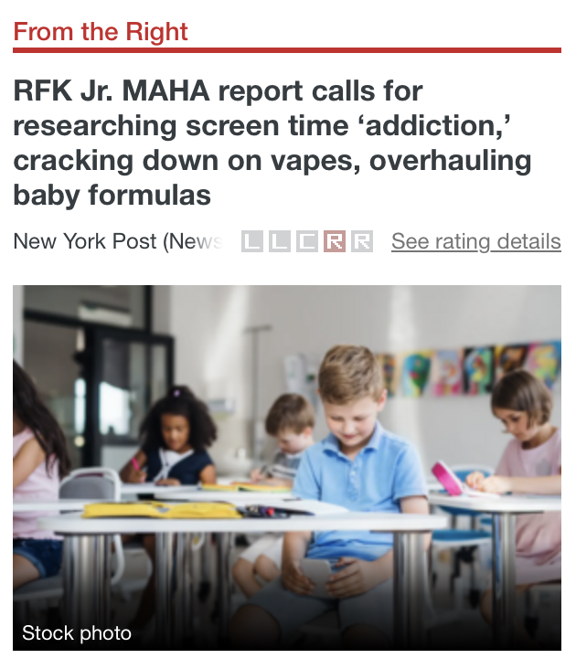

# NewsReader-AI : Bias Classification and Fake News Detection for English Articles with AI models

## Description:

NewsReader AI is a Streamlit-based application that detects political bias and fake news in online articles, taking as input the link to any article and gives the user a credibility score, political orientation probabilities, and an AI-generated detailed explanations of the results using Mistral. 

It combines fine-tuned transformer models — RoBERTa-base for fake news detection and BERT-cased for political bias classification — with the Mistral LLM to provide objective summaries, explanations, and risk assessments.

## How it works?

The user pastes the link of a news article, the app extracts the text using a robust scraping algorithm (requests + Trafilatura + undetectable Selenium to bypass restrictions), shows a preview of the article, and generates a summary before running the bias and fake news detection models.


Once the text is extracted, the system performs **political bias detection**.  
The model classifies each article into one of **five categories**:  `Left`/ `Leaning Left`/ `Center`/ `Leaning Right` / `Right`

### Example Output

<p align="center">
  
  
</p>

In addition to bias analysis, the system also performs **fake news detection**.  
The model classifies the article as **Real** or **Fake**, and provides probability scores for both classes, giving a clear indication of the article’s credibility.

<p align="center">
  
</p>

### LLM Interpretation

Beyond classification, **NewsReader AI** integrates the **Mistral LLM** to provide deeper insights.  
After the fake/real and political bias probabilities are obtained, the full article text and model outputs are passed to Mistral, adding a layer of explainability, helping users to understand the context.

<p align="center">
  
  
</p>

<p align="center">
  
</p>


## Usage

To run the application locally, follow these steps:

1. **Clone the repository and install dependencies**
   ```bash
   git clone https://github.com/gandpablo/NewsReader-AI
   cd NewsReader-AI/App
   pip install -r requirements.txt

2. **Download trained models**
   The models are too large to be stored on GitHub.
   I posted them on kaggle so they can be downloaded: [models](https://www.kaggle.com/models/gandpablo/bias-and-fake-news-detection-models)

   Then place them inside the folder: `App/saved_models/`

4. **Get your own Mistral API Key**
   Get your own API key from [Mistral](https://mistral.ai) and store it as an environment variable named `MISTRAL_API_KEY`

5. **Run the app**
   ```bash
   streamlit run app.py

## Models and Training
We experimented with a wide range of approaches before selecting the final models:
- **Classical vectorizers**: CountVectorizer (binary/frequency), TF-IDF (L1/L2 normalization), and n-grams (bigrams, trigrams).  
- **Machine learning algorithms**: Logistic Regression, SVC, Decision Trees, and ensemble methods.  
- **Deep learning**: an LSTM architecture, which improved results but suffered from overfitting.  
- **Transformers**: DistilBERT, XLNet, BERT, and RoBERTa.  

After extensive comparison:
- **RoBERTa-base** was chosen for **fake news detection** (≈70% accuracy).  
- **BERT-cased** was chosen for **political bias classification** (≈73% accuracy).  

Both models were fine-tuned on cleaned datasets and tested with accuracy, F1-score, and confusion matrices to ensure robustness.

---

## Data and Scrapers

The datasets were created with a **two-step scraping pipeline**:  
1. A scraper that collected **thousands of article links and metadata** from [AllSides](https://www.allsides.com/), including their political orientation labels (Left, Leaning Left, Center, Leaning Right, Right) and topics.  
2. A **generalized scraper** that retrieves the full text of any news article. It first attempts with `requests` and `Trafilatura`, and if blocked, switches automatically to **undetectable Selenium**, allowing it to bypass most restrictions.  

This scraper is extremely powerful and reusable, capable of extracting clean article text from almost any free-access news site, regardless of bot protection.  

For fake news detection, we gathered and cleaned **63,000+ articles** from multiple Kaggle sources, balancing labels into Real vs Fake.  
For political bias detection, we built our own dataset of **10,000+ articles** from AllSides with balanced ideological diversity.  

The processed datasets are provided in the `/data` folder (in `.zip` format for size reasons) and also uploaded to [Kaggle](https://www.kaggle.com/datasets/gandpablo/news-articles-for-political-bias-classification) for easier access 


  


